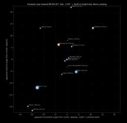
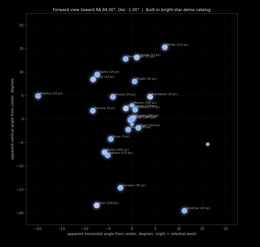

# Relativistic Spaceship Viewer

A small Tkinter + Matplotlib simulator for the view through a hypothetical relativistic spaceship windshield.

The motivating question is simple: **what would the sky look like if the ship were moving at a significant fraction of the speed of light?** The program puts the user in a relativistic driver’s seat, lets them choose a forward direction on the sky, and then slide from rest up to beta = v/c = 0.999. As speed increases, special-relativistic aberration compresses more of the rest-frame sky into the forward view, while optional Doppler color shifting and brightness boosting show why the forward sky becomes increasingly blue-shifted and intense.

The default view is centered on Orion with a fixed square windshield field of view of **45° × 45°**. A preset for **Tau Ceti** is included as a small science-fiction nod: this is the “what might Ryland Grace have seen if he had not been in a coma?” button. This project is not affiliated with Andy Weir, *Project Hail Mary*, or any film adaptation; it is just an affectionate physics demo.

  

---

## Example: Orion through the windshield

The images below show the built-in Orion demo catalog viewed through the 45° × 45° forward window. At modest speed the apparent distortion is noticeable but not overwhelming. By gamma ≈ 2, the corresponding beta is

```math
\beta = \sqrt{1 - \frac{1}{\gamma^2}} \approx 0.866.
```

At this speed, stars from a much wider region of the rest-frame sky are pulled into the forward view. This is the visual signature of relativistic aberration: the ship does not simply move through a static sky; the apparent angular coordinates of the incoming starlight transform into the ship frame.

| Rest frame, beta = 0 | beta = 0.30 | beta ≈ 0.87, gamma ≈ 2 |
|---|---|---|
|  |  |  |

---

## Features

- Interactive Tkinter GUI with embedded Matplotlib sky view.
- Velocity slider from beta = 0 to beta = 0.999.
- Special-relativistic aberration of stellar directions.
- Optional Doppler blue/red color shift.
- Optional Doppler brightness boost/dimming.
- Fixed **45° × 45°** “windshield” field of view.
- Mouse interaction:
  - **Left-drag:** grab/pan the sky.
  - **Right-drag:** rotate/yaw-pitch the ship.
- RA/Dec fields update automatically as the user pans or rotates.
- Preset directions: **Orion**, **Galactic Center**, and **Tau Ceti**.
- Built-in bright-star demo catalog for offline use.
- Optional CSV catalog loading.
- Optional Hipparcos fetch through `astroquery`/VizieR.

---

## Installation

Clone the repository:

```bash
git clone https://github.com/Fisicas/relativistic-spaceship-viewer.git
cd relativistic-spaceship-viewer
```

Create and activate a virtual environment if desired:

```bash
python -m venv .venv
.venv\Scripts\activate      # Windows
# source .venv/bin/activate  # macOS/Linux
```

Install the basic dependencies:

```bash
pip install -r requirements.txt
```

Run the viewer:

```bash
python relativistic_spaceship_viewer.py
```

For the optional Hipparcos catalog fetch button, install the optional dependencies:

```bash
pip install -r requirements-optional.txt
```

---

## The physics

This is a **special-relativistic sky-appearance simulator**. It does not simulate acceleration, ship dynamics, interstellar hazards, or general relativity. The relevant effects here are the Lorentz transformation of incoming light directions and the Doppler shift of the light.

Define beta as the ship speed divided by the speed of light:

```math
\beta = \frac{v}{c}.
```

The Lorentz factor is

```math
\gamma = \frac{1}{\sqrt{1-\beta^2}}.
```

For each star, define theta as the angle between the star’s rest-frame direction and the ship’s velocity vector. Equivalently,

```math
\mu = \cos \theta.
```

The apparent angle in the ship frame is determined by the relativistic aberration formula

```math
\mu' = \cos\theta' = \frac{\mu + \beta}{1 + \beta \mu}.
```

This is the core reason the forward view becomes crowded at high velocity. Stars that were originally far from the forward direction are pulled toward the direction of travel in the ship frame. In the limit beta → 1, an increasingly large portion of the rest-frame sky is compressed into a small forward cone.

The perpendicular component of the star direction transforms as

```math
\mathbf{s}'_\perp = \frac{\mathbf{s}_\perp}{\gamma(1+\beta\mu)}.
```

The parallel component is set by mu-prime. In the code, each catalog star is represented as a unit vector on the celestial sphere. The viewer transforms those vectors into the instantaneous ship frame, then projects them into the 45° × 45° windshield.

---

## Doppler factor

The frequency shift is represented by the Doppler factor

```math
D = \frac{\nu_{\rm obs}}{\nu_{\rm emit}} = \gamma(1+\beta\mu).
```

Therefore,

```math
\nu_{\rm obs} = D\nu_{\rm emit}
```

and

```math
\lambda_{\rm obs} = \frac{\lambda_{\rm emit}}{D}.
```

For stars ahead of the ship, mu > 0, so D > 1 and the light is blue-shifted. For stars behind the ship, D < 1 and the light is red-shifted. Near beta = 1, the forward Doppler factor can become very large.

The current display uses a deliberately simple color approximation:

1. Convert stellar B−V color index to an approximate blackbody temperature.
2. Multiply that temperature by the Doppler factor D.
3. Convert the shifted temperature to an RGB display color.

This is a visual approximation, not a full synthetic photometry calculation. A rigorous rendering would Doppler-shift each stellar spectrum and integrate it through human cone-response curves or camera-response curves.

---

## Brightness boost

The viewer optionally applies a qualitative relativistic brightness effect using approximately

```math
I_{\rm display} \propto D^3.
```

In magnitude form, this is implemented as

```math
m_{\rm display} = m - 2.5 \log_{10}(D^3).
```

This is useful for a visual demo, but it should not be interpreted as calibrated photometry. Depending on exactly what is being modeled — specific intensity, bolometric flux, detector bandpass, or photon count rate — a more complete treatment may require a different exponent and a full spectral-response model.

---

## Why the sky is not merely “blue”

A common simplification is to say that everything ahead becomes blue. Directionally that is true for the Doppler shift: wavelengths are shifted shorter when D > 1. But real stars emit broad spectra. At extreme velocity, much of the originally visible light from forward stars can be shifted into the ultraviolet, while originally infrared light can shift into the visible. The perceived color depends on the stellar spectrum and the observer/detector response.

The current version is therefore best treated as a teaching and intuition-building tool rather than a final physically exact relativistic renderer.

---

## Catalogs

The program includes a tiny built-in bright-star catalog so it works immediately offline. For a denser sky, use one of the catalog options.

### CSV loading

The CSV loader accepts columns such as:

```text
ra_deg, dec_deg, mag, bv, name, distance_pc
```

or HYG-style columns:

```text
ra, dec, mag, ci, proper, dist
```

If a generic `ra` column appears to be in hours, the loader converts it to degrees.

### Hipparcos via VizieR

The optional Hipparcos fetch requires:

```bash
pip install astroquery astropy
```

This retrieves a bright all-sky catalog through VizieR. The magnitude limit slider is used as the fetch limit.

---

## Controls

| Control | Effect |
|---|---|
| Velocity beta = v/c | Sets the ship speed used for aberration and Doppler shift. |
| Magnitude limit | Limits which catalog stars are considered. |
| RA/Dec | Sets the forward direction of the ship. |
| Orion | Centers the view on Orion in the default orientation. |
| Galactic Center | Points toward the Galactic Center. |
| Tau Ceti | Points toward Tau Ceti, for the *Project Hail Mary* joke. |
| Doppler colors | Enables/disables Doppler-shifted display colors. |
| Doppler brightness | Enables/disables brightness boost/dimming. |
| Labels | Labels the brightest visible stars. |
| Soft star glow | Adds an aesthetic glow around bright stars. |

Mouse controls in the sky view:

| Mouse action | Effect |
|---|---|
| Left-click drag | Grab/pan the sky. |
| Right-click drag | Rotate/yaw-pitch the ship. |

---

## Markdown/math rendering note

The README intentionally avoids inline LaTeX delimiters for the most important physics notation. GitHub supports inline math, but rendering can be more fragile across clients than display math, especially in tables and mobile views. For that reason, the substantive equations in this README are written as fenced `math` blocks, while short inline symbols are written as ordinary text or Unicode where possible.

---

## Important limitations

This first release models the **instantaneous apparent sky** for an observer moving relativistically near the Solar System. It does not yet model a complete voyage through 3D space.

Current limitations include:

- No finite-duration travel through a 3D stellar catalog.
- No changing parallax during the trip.
- No proper motion propagation.
- No acceleration profile.
- No time-of-flight rendering.
- No interstellar dust/gas impact model.
- No CMB, cosmic-ray, or radiation-hazard model.
- No full spectral rendering through human or instrument response curves.

A future version could add a distance/time slider and propagate the observer toward a target star such as Tau Ceti. At that point, nearby stars would shift due to actual observer translation, not merely relativistic aberration.

---

## Repository layout

```text
relativistic-spaceship-viewer/
├── relativistic_spaceship_viewer.py
├── README.md
├── requirements.txt
├── requirements-optional.txt
├── LICENSE
├── .gitignore
└── docs/
    └── images/
        ├── orion_beta_0.jpg
        ├── orion_beta_0_30.jpg
        └── orion_beta_0_87_gamma_2.jpg
```

---

## References and related reading

- John Baez / Alexis Brandeker, “What would a relativistic interstellar traveller see?”
- Relativistic aberration of light.
- Relativistic Doppler effect.
- Relativistic beaming/searchlight effect.
- Andy Weir, *Project Hail Mary* — for the Tau Ceti button’s emotional support.

---

## License

MIT License. See [`LICENSE`](LICENSE).
